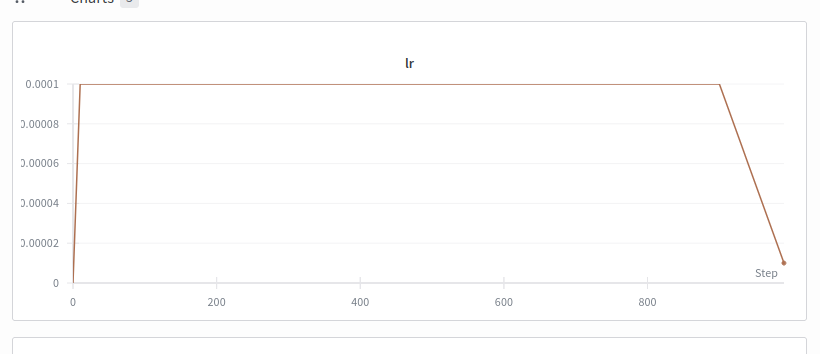
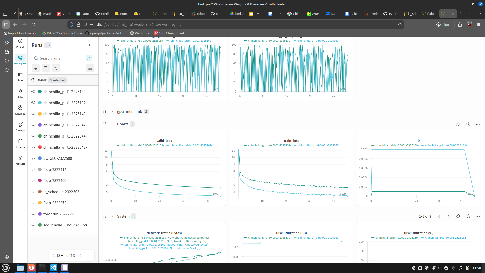
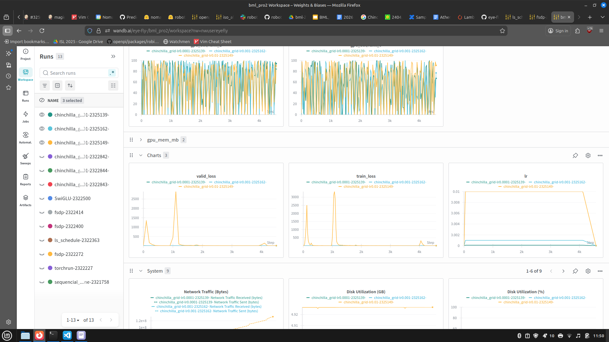

## Implementation Summary

- **Steps 2, 3, 5, 6:** Implemented in `Main.py`.  
  - `wandb` was used to log both training metrics and hyperparameters.  
  - Hyperparameters were saved to `wandb` config for easy tracking.  
  - Warmup-Stable-Decay (WSD) learning rate schedule implemented via the simple function `get_wsd_schedule`.

- **Step 4** FSDP implemented in `fsdp_main.py`.  
  - Running `wandb` on Athena caused the error:  
    ```
    {"time":"2026-01-10T21:03:09.276081741+01:00","level":"ERROR","msg":"monitor: failed to initialize GPU resource: monitor: could not get GPU binary port: timeout reading portfile /net/tscratch/people/plgjm438620/slurm_jobdir/2322414/tmp.t0022/wandb-system-monitor-portfile-1774696007"}
    ```
  - Manual GPU utilization logging was added instead. Logging was rather slow, performed every 10 steps.  
  - The 0% utilization observed every 100 steps occurs when validation loss is calculated, likely due to `dist.all_reduce`.  
  - FSDP setup uses `torch.distributed.fsdp.FullyShardedDataParallel` with environment variables from `torchrun` (`WORLD_SIZE`, `RANK`, `LOCAL_RANK`).  
  - Mixed precision used: `bfloat16`, supported on A100 GPUs.

- **Step 7 (Grid Search & Compute-Optimal Steps):** Implemented in `grid_search.py`.  
  - Number of steps is calculated inside the function `train_model`.  
  - Combined code from `Main.py` and `fsdp_main.py` to enable 2 GPU training with all other subtasks.

---

## Learning Rate Schedule



---

## Compute-Optimal Tokens and Steps

Optimal number of tokens:  
- `D = 20 * N`

Training steps formula: 
- `training_steps = D / (global_batch_size * sequence_length)`
Where:  
- `global_batch_size = 256 * 2` (as in my script batch_size was set per gpu) 
- `sequence_length = 256`  

Values from runs:  
- Model parameters: 30.00M  
- Optimal tokens: 599.91M  
- Training steps: 4576

---

## Multi-GPU Training Verification

- GPU utilization:

  


- Grid search results:

  


---

## GPU Hours Used
[athena][plgjm438620@login01 bml]$ echo "GPU hours used: $(hpc-jobs-history -A plgpkattenion-gpu-a100 -d 250 | awk '$11 ~ /^[0-9.]*$/ {sum += $11} END {print sum}')"
GPU hours used: 6.43